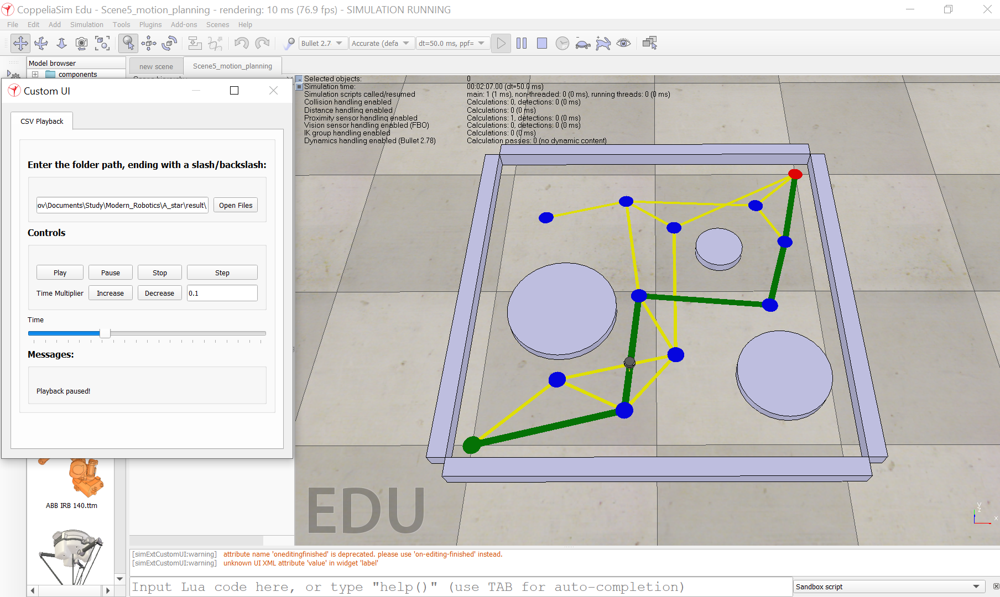

This is the implementation of the A* path planner written in Python.
The script reads from CSV files: (1) a list of nodes with heuristics and (2) a list of edges with costs of travel. Saves CSV file with the shortest found path.
Visualized in CoppeliaSim (http://hades.mech.northwestern.edu/index.php/CoppeliaSim_Introduction).

